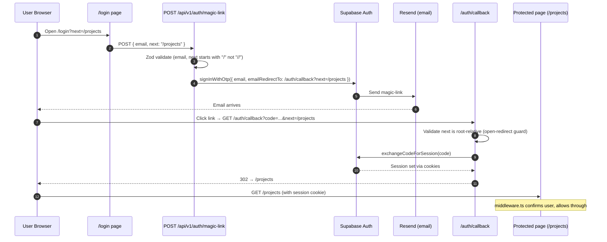
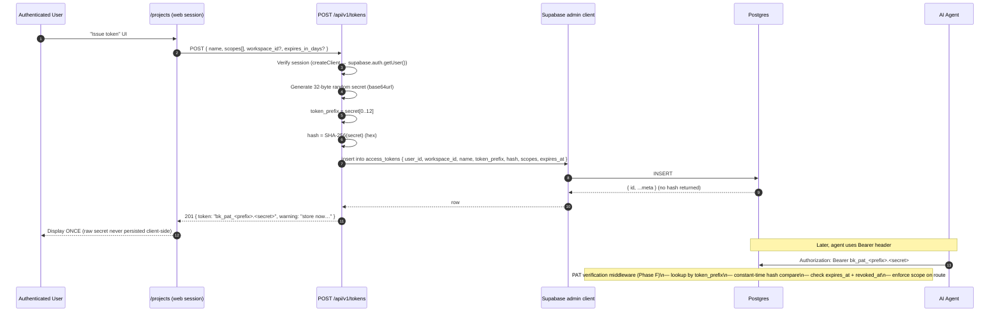
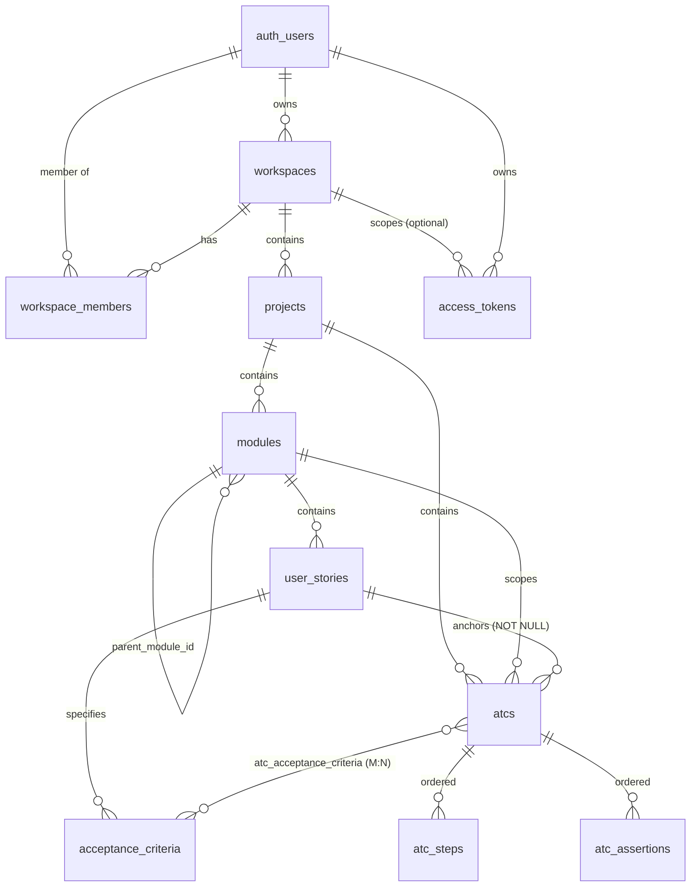

# SRS — Architecture (Bunkai TMS)

> Generated by `/project-discovery` Phase 2 (Architecture / SRS) on 2026-05-23. Anchored to verbatim code in `<target>/lib/`, `<target>/app/api/`, `<target>/middleware.ts`, `<target>/supabase/migrations/*`. Refresh by re-running Phase 2.

---

## 1. System context (C4 — Level 1)

```mermaid
flowchart LR
    Elena([Elena — QA Engineer])
    Mateo([Mateo — QA Lead])
    Sara([Sara — Developer])
    Karim([Karim — AI Agent])

    Jira[(Jira Cloud)]
    GitHub[(GitHub)]
    Resend[(Resend — email)]

    Bunkai[Bunkai TMS]
    Supabase[(Supabase\nAuth + Postgres\n+ Realtime + Storage)]
    Vercel[(Vercel\nedge + serverless)]

    Elena -->|web UI| Bunkai
    Mateo -->|web UI dashboards| Bunkai
    Sara -->|web UI + API| Bunkai
    Karim -->|HTTP+PAT| Bunkai

    Bunkai -->|hosted on| Vercel
    Bunkai -->|DB+Auth+Realtime| Supabase
    Bunkai -.->|magic-link email| Resend
    Bunkai -.->|US sync (planned)| Jira
    Sara -.->|PR status (planned)| GitHub
```

**External actors**: 4 personas (3 human + 1 AI). **External services**: Supabase (managed), Vercel (host), Resend (transactional email), Jira (User Story sync — planned), GitHub (PR integration — planned).

Sources: routes (`<target>/app/api/v1/*`), middleware (`<target>/middleware.ts`), env validation (`<target>/lib/env.ts`).

---

## 2. Container view (C4 — Level 2)

```mermaid
flowchart TB
    subgraph Browser
        SPA[Next.js Client\nReact 19 + shadcn + Radix\n@supabase/ssr browser client]
    end

    subgraph Vercel[Vercel Edge + Serverless]
        Middleware[middleware.ts\nSession check on every request]
        RSC[Server Components / Route Handlers\n/api/openapi · /api/v1/*]
        SSR[Server-side Supabase client\n@supabase/ssr server]
    end

    subgraph Supabase[Supabase Project]
        Auth[(Supabase Auth\nmagic-link OTP)]
        DB[(Postgres 16\nRLS-everywhere\n11 tables · 8 migrations)]
        RT[(Realtime\nchannels)]
        Storage[(Storage\nevidence files — planned)]
    end

    Resend[(Resend)]

    SPA -->|/login → POST /api/v1/auth/magic-link| Middleware
    Middleware --> RSC
    RSC -->|cookie-scoped SQL| SSR --> DB
    RSC -->|admin SQL (service role)| DB
    Auth -.->|email send| Resend
    DB -.->|RLS-bypass functions| RSC
    SPA -.->|subscribe| RT
    RT -.->|broadcasts| SPA
```

**Containers**:
- **Browser SPA**: Next.js 15 client (React 19, shadcn/Radix UI, `@supabase/ssr` browser client cached singleton per tab — `<target>/lib/supabase/client.ts`).
- **Vercel edge middleware**: refreshes Supabase session on every request matching `'/((?!_next/static|_next/image|favicon.ico|.*\\..*).*)'`. Redirects unauthenticated callers from protected paths to `/login?next=<path>`.
- **Vercel serverless functions** (Route Handlers): `/api/openapi`, `/api/v1/health`, `/api/v1/auth/magic-link`, `/api/v1/tokens`, `/api/v1/tokens/[id]`.
- **Supabase**: managed Postgres 16, Auth (magic-link OTP), Realtime channels, Storage (planned for evidence files).

---

## 3. Component view (Next.js app)

| Component | Path | Responsibility |
|---|---|---|
| **Edge middleware** | `<target>/middleware.ts` | Session refresh + protected-path redirect. Uses `@supabase/ssr` `createServerClient` with cookie adapter. |
| **API handler wrapper** | `<target>/lib/api/handler.ts` | `withApiHandler` — propagates `x-request-id`, structured access log, central error mapping (`ApiError` → envelope, `ZodError` → 422, default → 500). |
| **API error envelope** | `<target>/lib/api/error-envelope.ts` | `ApiError` class + 12 canonical codes (`bad_request`, `validation_failed`, `unauthorized`, `forbidden`, `not_found`, `method_not_allowed`, `conflict`, `idempotency_key_required`, `idempotency_key_invalid`, `rate_limited`, `internal_error`, `upstream_error`). |
| **Request ID** | `<target>/lib/api/request-id.ts` | Reuse inbound `x-request-id` header or mint a fresh UUID. Header propagated on every response. |
| **Idempotency** | `<target>/lib/api/idempotency.ts` | Header validation (`idempotency-key`, 8–128 chars `[a-zA-Z0-9_-]`). Persistence layer NOT yet implemented (Phase F). |
| **Structured logging** | `<target>/lib/api/logging.ts` | One-line JSON to stdout (Vercel indexed). Fields: `request_id`, `method`, `path`, `status`, `duration_ms`, `error_code`. |
| **Supabase server client** | `<target>/lib/supabase/server.ts` | `createClient()` for Server Components / Route Handlers. Uses cookies via `next/headers`. Read-only cookies in Server Components — middleware writes rotations. |
| **Supabase admin client** | `<target>/lib/supabase/admin.ts` | Service-role client. `server-only`. Bypasses RLS — used for ops that need verified inputs (e.g., insert PAT with verified `user_id`). |
| **Supabase browser client** | `<target>/lib/supabase/client.ts` | Per-tab singleton via `createBrowserClient`. Reads `NEXT_PUBLIC_*` statically so Next.js inlines them. |
| **RPC wrappers** | `<target>/lib/supabase/rpc.ts` | Typed wrappers for `bunkai_bootstrap_workspace`, `bunkai_save_atc`. Keeps argument names in sync with migrations. |
| **Workspace scoping** | `<target>/lib/supabase/with-workspace.ts` | Defence-in-depth helper that pre-filters `workspace_id` on read queries. RLS is the real boundary — this is read-intent clarity. |
| **Env validation** | `<target>/lib/env.ts` | Zod-validates `NEXT_PUBLIC_SUPABASE_URL`, `NEXT_PUBLIC_SUPABASE_ANON_KEY`, `SUPABASE_SERVICE_ROLE_KEY` at module load. Throws on import if invalid. `server-only`. |
| **Auth provider (UI)** | `<target>/components/providers/auth-context.tsx` | React Context exposing `useAuth()` with `signInWithMagicLink(email, redirectTo)` + `signOut()`. Subscribes to `onAuthStateChange`. |

### TypeScript path aliases (`<target>/tsconfig.json`)

```json
{
  "compilerOptions": {
    "paths": {
      "@/*": ["./*"],
      "@app/*": ["./app/*"],
      "@components/*": ["./components/*"],
      "@lib/*": ["./lib/*"]
    }
  }
}
```

QA-framework note: KATA imports must use the same alias style (`@lib/`, `@api/`, `@schemas/`) — see `<framework>/CLAUDE.md` §10.

---

## 4. Auth flow (sequence)



**Open-redirect guard**: both `POST /api/v1/auth/magic-link` (Zod refine `value.startsWith('/') && !value.startsWith('//')`) and `GET /auth/callback` (inline check `safeNext = next.startsWith('/') && !next.startsWith('//') ? next : '/projects'`) reject protocol-relative URLs.

Sources: `<target>/app/api/v1/auth/magic-link/route.ts`, `<target>/app/auth/callback/route.ts`, `<target>/middleware.ts`.

---

## 5. PAT (Personal Access Token) flow



**Current status** (2026-05-23): PAT **issuance** (`POST /api/v1/tokens`), **listing** (`GET /api/v1/tokens`), and **soft-revoke** (`DELETE /api/v1/tokens/[id]`) are implemented. The **bearer verification middleware** that authenticates Karim's API calls is referenced in code comments ("Phase F") but **not yet implemented** — all v1 routes today are session-cookie-only. Mark as Discovery Gap.

Sources: `<target>/app/api/v1/tokens/route.ts`, `<target>/app/api/v1/tokens/[id]/route.ts`, `<target>/supabase/migrations/0008_access_tokens.sql`.

---

## 6. Database schema (ER summary)



**11 tables · 8 migrations · RLS on every table**. Full DDL in `<framework>/.context/business/domain-glossary.md`. The schema is the single most important architectural artifact — the framework's regression suite anchors to it.

---

## 7. Security architecture

### 7.1 Authentication

| Mechanism | Used by | Implementation |
|---|---|---|
| **Magic-link OTP** | All human users | Supabase `signInWithOtp`; `/api/v1/auth/magic-link` validates `email` + `next` (open-redirect guard); `/auth/callback` exchanges code → session |
| **Session cookies** | Browser SPA + all `/api/v1/*` routes today | `@supabase/ssr` cookie adapter; middleware refreshes on every request |
| **Personal Access Tokens (PATs)** | AI agents, CLIs, CI | `bk_pat_<prefix>.<secret>` format; SHA-256 stored; 12-char prefix for O(1) lookup; **bearer middleware not yet implemented** (Phase F) |

### 7.2 Authorization

**Two layers**:

1. **PostgreSQL RLS** — primary. Every table has explicit `select`/`insert`/`update`/`delete` policies. After migration `0005_rls_helpers.sql`, policies delegate to SECURITY DEFINER helpers to avoid 42P17 recursion errors:
   - `bunkai_is_workspace_member(ws_id)` — any `active` row.
   - `bunkai_can_write_workspace(ws_id)` — `member`, `admin`, or `owner` with `status='active'`.
   - `bunkai_is_workspace_admin(ws_id)` — `admin` or `owner` with `status='active'`.
   - `bunkai_is_workspace_owner(ws_id)` — `owner` only with `status='active'`.

2. **PAT scope enforcement** — application-side (when Phase F lands): each route handler will assert `request.token.scopes` includes the required scope:
   - `atc:read` for `GET /api/v1/atcs/*`
   - `atc:write` for `POST/PATCH/DELETE` on ATC tables
   - `run:execute` for `POST /api/v1/runs*`
   - `workspace:admin` for member/plan mutations

### 7.3 Threat model (quick)

| Threat | Mitigation in place | QA framework test |
|---|---|---|
| Cross-tenant data leak | RLS on every table; helper functions can't be bypassed | Cross-tenant API smoke (user A reads user B's workspace → 403/404) |
| Token leak in source control | `bk_pat_` family prefix → GitHub/GitGuardian secret scanners flag it | n/a (vendor mechanism) |
| Token brute-force | 256-bit entropy random + SHA-256 hash + prefix-index lookup (no plaintext scan) | n/a (load testing out of scope) |
| Open redirect on magic-link | `next` validated as root-relative, no `//`, in both POST and callback | E2E negative path test |
| Session fixation | Supabase manages rotation; middleware sets new cookies | n/a (vendor mechanism) |
| Email enumeration via magic-link | Supabase returns success regardless of email existence | E2E test verifies same response time for known + unknown email (out of MVP scope) |
| Service-role-key in client bundle | `lib/env.ts` is `server-only`; service key never imported from `lib/supabase/client.ts` | Repo lint catch + framework smoke that production bundle contains no `SUPABASE_SERVICE_ROLE_KEY` |

### 7.4 Error envelope contract (security-relevant)

Every `/api/v1/*` route returns errors as `{ error: { code, message, details?, request_id? } }`. Codes are stable strings — clients branch on `code`, not `message`. Status codes are derived from code per `DEFAULT_STATUS` map.

Stable codes (12): `bad_request` · `validation_failed` · `unauthorized` · `forbidden` · `not_found` · `method_not_allowed` · `conflict` · `idempotency_key_required` · `idempotency_key_invalid` · `rate_limited` · `internal_error` · `upstream_error`.

Source: `<target>/lib/api/error-envelope.ts`.

---

## 8. API surface (today)

```
GET    /api/openapi                      Static OpenAPI 3 spec (read from public/openapi.json)
GET    /api/v1/health                    { ok, service, env, ts }
POST   /api/v1/auth/magic-link           { email, next? } → { ok }
GET    /api/v1/tokens                    Session auth → tokens of caller (RLS-enforced)
POST   /api/v1/tokens                    Session auth → { token: "bk_pat_…", warning }
DELETE /api/v1/tokens/[id]               Session auth → 204 (soft-revoke)
```

**Future endpoints** (referenced in PRD journeys + product canon, **not yet implemented**):
- `GET /api/v1/me` — session/PAT introspection.
- `GET /api/v1/projects`, `POST /api/v1/projects`, `GET/PATCH/DELETE /api/v1/projects/[id]`.
- `GET /api/v1/modules*`, `POST /api/v1/modules*`.
- `GET /api/v1/user_stories*`, `POST /api/v1/user_stories*` + Jira sync hooks.
- `GET /api/v1/atcs*`, `POST /api/v1/atcs*` — full CRUD with bulk `bunkai_save_atc` RPC under the hood.
- `GET /api/v1/tests/[id]` — chain of ATCs, expandable.
- `POST /api/v1/runs`, `POST /api/v1/runs/[id]/steps/[stepId]/result`, `POST /api/v1/runs/[id]/finish`.
- `POST /api/v1/bugs`.

These shape the framework's roadmap: API ATCs will land in tandem with their endpoints. Until then, framework smokes only cover the 6 endpoints listed above.

---

## 9. Build + deploy topology

| Layer | Tech | Notes |
|---|---|---|
| Build | Next.js 15 (App Router) + Turbopack (default) | `outputFileTracingRoot: path.resolve(import.meta.dirname)` (`next.config.ts`); `typedRoutes: true` |
| Runtime | Vercel (serverless functions + edge middleware) | Inferred from `webapp_domain: upexbunkai.vercel.app`; no `vercel.json` checked-in |
| DB host | Supabase managed | `SUPABASE_PROJECT_REF` in `.env`; no `supabase/config.toml` for local dev |
| CDN | Vercel built-in | Static assets in `<target>/public/` |
| CI | **Discovery Gap** — no `.github/workflows/` in target | Vercel-only deploy presumed; framework will need to coordinate when CI lands |
| Local dev | Bun + Next.js dev server | `bun dev` (blocked today by `package.json` ↔ `bun.lock` desync) |

---

## 10. Cross-cutting concerns

### 10.1 Logging

JSON-per-line to stdout. Fields: `level`, `ts`, `component: "api"`, `request_id`, `method`, `path`, `status`, `duration_ms`, optional `error_code`, `message`. Vercel indexes stdout automatically.

### 10.2 Tracing

`x-request-id` header propagated end-to-end. Inbound header reused if 1-128 chars; otherwise UUID minted. Every error envelope includes `request_id` so users can quote it in bug reports.

### 10.3 Caching

- `GET /api/openapi`: `cache-control: public, max-age=300, s-maxage=300` (5-min CDN cache).
- `GET /api/v1/health`: `force-dynamic` (no cache; freshness > efficiency).
- `GET /api/v1/tokens`: no cache header (defaults to private + must-revalidate by Next.js).

### 10.4 Idempotency (Phase F)

Header `idempotency-key` validated by `lib/api/idempotency.ts` (pattern `[a-zA-Z0-9_-]{8,128}`). Persistence layer (`idempotency_keys` table) **not yet implemented** — currently every request looks like a first occurrence.

---

## 11. Discovery Gaps (architecture-specific)

- [ ] **PAT bearer middleware** (`Phase F` per code comments) — gating Karim's actual API consumption.
- [ ] **Idempotency persistence layer** — header validation exists; replay store does not. P0 blocker for safe `POST /api/v1/runs`.
- [ ] **Rate limiting** — `rate_limited` error code exists, but no middleware. Supabase magic-link 429 surfaces as `rate_limited` upstream; no first-party limits.
- [ ] **Bug/Test/Run entities** — referenced in PRD + journeys; not in migrations 0001-0008.
- [ ] **Realtime channels naming** — Journey 2 + 3 reference Supabase Realtime; channel conventions undefined.
- [ ] **`vercel.json` / deploy config** — not checked-in; framework can't audit deploy gates.
- [ ] **`supabase/config.toml`** — absent; no local Supabase dev story yet (would need `supabase init` then `supabase start`).
- [ ] **Telemetry endpoint** — KPI references opt-in telemetry; no route detected.
- [ ] **`access_tokens` delete policy** — only `select/insert/update` RLS; hard delete blocked. Confirm intent.
