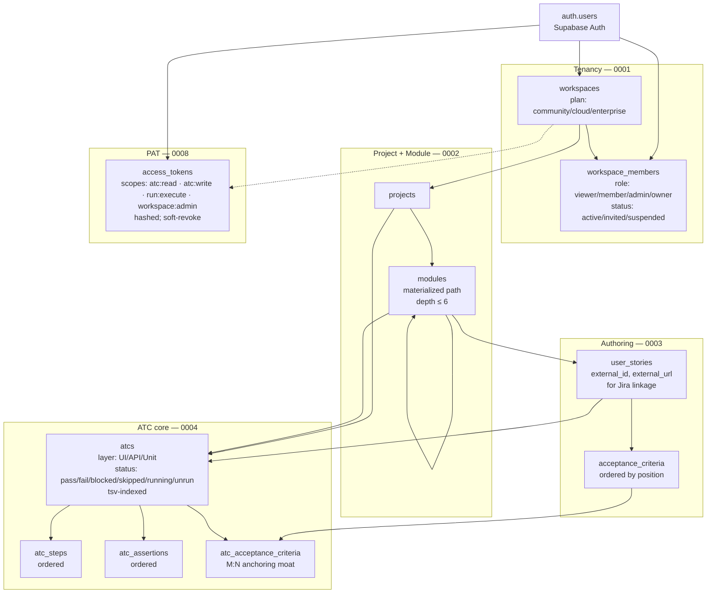

# Business Data Map — Bunkai TMS

> Generated by `/project-discovery` Context Generator (Phase 5) on 2026-05-24. Synthesizes outputs from Phase 1 (`business-model.md`, `domain-glossary.md`), Phase 2 (`SRS/architecture.md`, `functional-specs.md`), and Phase 3 (`infrastructure/backend.md`).
>
> Refresh with `/business-data-map` standalone command. This is the canonical "what this system does" map — `/master-test-plan` consumes it as primary input.

---

## 1. System purpose (one paragraph)

Bunkai TMS is a multi-tenant Test Management System whose database **enforces** the discipline its competitors leave optional: every Acceptance Test Case (ATC) anchors to a User Story and at least one Acceptance Criterion (the "anchoring moat"). Workspaces own Projects, Projects own a tree of Modules (depth ≤6), Modules own User Stories, Stories own ordered Acceptance Criteria, and ATCs reference both a Story (NOT NULL FK) and the Criteria they cover via an M:N join. Authentication is magic-link via Supabase; API consumers (CLIs + AI agents like Karim) authenticate via Personal Access Tokens (PATs) with scope-restricted permissions (`atc:read`, `atc:write`, `run:execute`, `workspace:admin`). RLS-everywhere keeps tenants isolated.

---

## 2. Entity map (compact)

11 tables across 8 migrations. Full DDL in `domain-glossary.md`.



**Key cardinalities** (for test-data planning):
- 1 workspace ⟶ N members, N projects, N PATs (or scoped global PATs)
- 1 project ⟶ N modules (tree), N ATCs
- 1 module ⟶ N modules (children, max depth 6), N user_stories, N atcs
- 1 user_story ⟶ N acceptance_criteria, N atcs (anchoring NOT NULL FK)
- 1 atc ⟶ N atc_steps, N atc_assertions, ≥1 acceptance_criteria via atc_acceptance_criteria (app-enforced minimum)

**Discovery Gaps (entities)**:
- `tests`, `runs`, `run_step_results`, `bugs` — referenced in product canon (user-journeys.md, business-model.md) but not yet migrated. Treated as "Phase 2 schema" — framework regression suite targets only entities 0001-0008 today.

---

## 3. Core system flows

### Flow A — Account bootstrap (Elena's first login)

```
[Email] → POST /api/v1/auth/magic-link
              │ (Zod-validate email + next; reject open-redirect)
              ↓
         supabase.auth.signInWithOtp({ email, emailRedirectTo: /auth/callback?next=… })
              │
              ↓
[Click email link] → GET /auth/callback?code=…&next=/projects
              │
              ↓
         supabase.auth.exchangeCodeForSession(code)
              │ Sets session cookies via @supabase/ssr adapter
              ↓
         302 → /projects
              │ middleware.ts confirms session on every navigation
              ↓
         If no workspace membership exists → /onboarding redirect chain
              │
              ↓
         OnboardingForm calls RPC bunkai_bootstrap_workspace(slug, name)
              │ SECURITY DEFINER atomic INSERT workspaces + workspace_members(owner)
              ↓
         302 → /projects (now populated)
```

**Tables mutated**: `auth.users` (Supabase-managed), `workspaces`, `workspace_members`.

**Entry points**: `<target>/app/api/v1/auth/magic-link/route.ts`, `<target>/app/auth/callback/route.ts`, `<target>/middleware.ts`, `<target>/app/(app)/onboarding/page.tsx`, RPC `bunkai_bootstrap_workspace`.

### Flow B — Authoring (Elena builds a Project + Module tree + Story + AC + ATC)

```
/projects (workspace home)
   │  + Create Project → INSERT projects
   ↓
/projects/[projectSlug]
   │  + Add Module (root or child) → INSERT modules
   │     (validate path depth ≤ 6 — BR-008)
   ↓
   │  + Add User Story to module
   │     INSERT user_stories (+ optionally external_id pointing to Jira BK-NNN)
   ↓
   │  + Add Acceptance Criterion to story
   │     INSERT acceptance_criteria (unique position per story — BR-010)
   ↓
   │  + Create ATC anchored to (project, module, user_story)
   │     INSERT atcs (layer ∈ {UI, API, Unit})
   │     INSERT atc_steps (ordered)
   │     INSERT atc_assertions (ordered)
   │     INSERT atc_acceptance_criteria (≥1, the anchoring moat)
   │
   ↓ "Save ATC" button → RPC bunkai_save_atc(id, title, layer, tags, us_id, steps_jsonb, assertions_jsonb, ac_ids_uuid[])
        SECURITY INVOKER · increments atcs.version · replace-on-write children
```

**Tables mutated**: `projects`, `modules`, `user_stories`, `acceptance_criteria`, `atcs`, `atc_steps`, `atc_assertions`, `atc_acceptance_criteria`.

**Triggers fired**: `atcs_set_updated_at` (refresh `updated_at`), `atcs_refresh_tsv` (rebuild `tsv` from `title + tags`).

**Entry points**: planned `/api/v1/projects/*`, `/api/v1/modules/*`, `/api/v1/user_stories/*`, `/api/v1/atcs/*` (Discovery Gap — endpoints not yet checked-in); RPC `bunkai_save_atc` (`<target>/supabase/migrations/0007_save_atc.sql`).

### Flow C — Manual run + bug filing (Elena, day 3 of sprint)

```
[Elena opens TEST-008 in table view, filters "smoke" tag]
   │
   ↓ Start Run (env: staging, executor: self) → POST /api/v1/runs    [PLANNED — entity not migrated]
        INSERT runs (+ idempotency_key for retry safety)
   │
   ↓ Walk 7 ATCs in sequence
        For each step → POST /api/v1/runs/[id]/steps/[stepId]/result    [PLANNED]
           INSERT run_step_results (status, duration_ms, evidence_url)
           UPDATE atcs.status (running → pass/fail/blocked/skipped)
   │
   ↓ ATC-005 step 3 FAILS
        Bug form pre-fills (module_id, atc_id, run_id, env, steps_to_reproduce)
        POST /api/v1/bugs    [PLANNED — bugs table not migrated]
        Optional Jira sync (one-way push to BK project via acli / API)
   │
   ↓ Abort Run → POST /api/v1/runs/[id]/finish { status: aborted, reason }    [PLANNED]
        UPDATE runs.status, runs.finished_at
   │
   ↓ Supabase Realtime broadcasts on channel "runs:project_id=X"    [PLANNED — channel naming TBD]
        Mateo's Dashboard ticks within 5s (per Journey 2 SLA)
```

**Status**: blocked end-to-end by missing `tests`, `runs`, `run_step_results`, `bugs` entities. Framework's contract tests for Flow C cannot land until schema ships.

### Flow D — Agentic run (Karim, nightly cron)

```
[Cron @ 02:00 UTC]
   │  Karim wakes up with PAT (scopes: atc:read, run:execute, atc:write for bug filing)
   ↓
GET /api/v1/me                    [PLANNED endpoint] — confirm token + scopes
   │
   ↓
GET /api/v1/tests/[id]?expand=atcs.steps,atcs.assertions    [PLANNED endpoint]
        Returns ordered ATC chain + steps + assertions + env hints
   │
   ↓
POST /api/v1/runs { test_id, env, executor: { type: agent, identity }, idempotency_key }
   │  [PLANNED] — idempotency-key validated by lib/api/idempotency.ts (present);
   │  replay store (idempotency_keys table) NOT yet implemented
   ↓
For each step: drive app via Playwright → POST /api/v1/runs/[run]/steps/[step]/result
   │
   ↓
On failure: POST /api/v1/bugs (auto-context: module, atc, run, env, steps-to-reproduce)
   │
   ↓
POST /api/v1/runs/[run]/finish { status, finished_at }
   │
   ↓
Supabase Realtime broadcast — Dashboard reflects results
```

**Cross-cuts** for Karim (vs Elena Flow C): Bearer-PAT auth at every request (Phase F bearer middleware not yet implemented), idempotency-key headers, scope-grain authorization checks.

### Flow E — PAT lifecycle (Elena issues a token for Karim)

```
[Elena in /projects, "API Tokens" UI]
   │
   ↓
POST /api/v1/tokens { name, scopes[], workspace_id?, expires_in_days? }
   │  session-authenticated (cookie)
   │  Zod-validate: scopes subset of {atc:read, atc:write, run:execute, workspace:admin}
   │  Generate 32-byte secret → base64url → bk_pat_<12char>.<rest>
   │  SHA-256(secret) stored as hash; token_prefix indexed for O(1) lookup
   │
   ↓ INSERT access_tokens (user_id, workspace_id?, name, token_prefix, hash, scopes, expires_at)
   │
   ↓ 201 { token: "bk_pat_…", warning: "store now — cannot retrieve later" }
   │
   ↓ Elena hands token to Karim (e.g., GitHub Actions secret)
   │
   ↓ Karim later calls /api/v1/* with Authorization: Bearer bk_pat_<prefix>.<secret>
   │  Bearer middleware [PHASE F — NOT YET IMPLEMENTED]:
   │     lookup by token_prefix → constant-time hash compare → check revoked_at + expires_at →
   │     enforce required scope on route
   │
   ↓ When Elena revokes: DELETE /api/v1/tokens/[id]
   │  SOFT-REVOKE: UPDATE access_tokens SET revoked_at = now()
   │  Row never hard-deleted (BR-022 — audit retained)
```

**Tables mutated**: `access_tokens` only.

**Entry points**: `<target>/app/api/v1/tokens/route.ts` (POST + GET), `<target>/app/api/v1/tokens/[id]/route.ts` (DELETE).

---

## 4. Triggers (DB-level)

All from `<target>/supabase/migrations/0004_atcs.sql`:

| Trigger | Fires on | Action |
|---|---|---|
| `atcs_set_updated_at` | BEFORE UPDATE on `atcs` | Sets `NEW.updated_at = now()` via `bunkai_set_updated_at()` |
| `atcs_refresh_tsv` | BEFORE INSERT OR UPDATE OF (title, tags) on `atcs` | Rebuilds `NEW.tsv = to_tsvector('english', title + ' ' + tags)` via `bunkai_atcs_refresh_tsv()` |

---

## 5. Stored procedures / RPCs

| RPC | Migration | Security | Purpose |
|---|---|---|---|
| `bunkai_is_workspace_member(ws_id)` | `0005` | SECURITY DEFINER STABLE | RLS helper — active member check |
| `bunkai_can_write_workspace(ws_id)` | `0005` | SECURITY DEFINER STABLE | RLS helper — role ∈ {member, admin, owner} + active |
| `bunkai_is_workspace_admin(ws_id)` | `0005` | SECURITY DEFINER STABLE | RLS helper — role ∈ {admin, owner} + active |
| `bunkai_is_workspace_owner(ws_id)` | `0005` | SECURITY DEFINER STABLE | RLS helper — role = owner + active |
| `bunkai_bootstrap_workspace(slug, name)` | `0006` | SECURITY DEFINER | Atomic workspace + owner-membership INSERT; validates slug regex + non-empty name |
| `bunkai_save_atc(atc_id, title, layer, tags, us_id, steps jsonb, assertions jsonb, ac_ids uuid[])` | `0007` | SECURITY INVOKER | Bulk save ATC with replace-on-write for children; increments `atcs.version` |

---

## 6. Scheduled jobs / cron

**No first-party schedulers detected.** Discovery Gaps:

- No `pg_cron` jobs in migrations.
- No GitHub Actions cron workflows (no `.github/workflows/` at all in target).
- No Vercel Cron in `vercel.json` (file absent).

**Implication**: any "nightly" Karim run (Journey 3) must be triggered externally — most likely via GitHub Actions in a sibling repo or a Vercel Cron config to be added.

---

## 7. Webhooks / inbound integrations

**Outbound** (system calls external services):
- **Supabase Auth → Resend**: magic-link email delivery. Configured at Supabase project level, not in repo.
- **Future Jira sync**: `user_stories.external_id`, `external_url` suggest bidirectional sync; mechanism (push from Bunkai vs pull from Jira) not yet implemented. Discovery Gap.

**Inbound** (system receives external calls):
- `GET /auth/callback?code=…` — Supabase Auth → Bunkai. The only inbound webhook today.
- **No GitHub webhook**, **no Jira webhook**, **no Stripe webhook** (no billing entity yet — see business-model.md, MVP Cloud pricing TBD).

---

## 8. Integration points map

| External | Bunkai role | Direction | Data exchanged | Status |
|---|---|---|---|---|
| **Supabase Auth** | Identity provider | Bunkai ↔ Supabase | Magic-link OTP, session cookies, JWT for RLS | Live |
| **Supabase Postgres** | Persistence | Bunkai → Supabase | All app data (11 tables) | Live |
| **Supabase Realtime** | Push channel | Supabase → Bunkai SPA | Run state broadcasts | Planned (channels not defined) |
| **Supabase Storage** | Evidence files | Bunkai → Supabase | Screenshots, traces (Phase 2) | Planned |
| **Resend** | Email delivery | Supabase → Resend | Magic-link emails | Live (via Supabase auth provider settings) |
| **Vercel** | Hosting | n/a | App build artifacts + logs | Live |
| **Jira (BK)** | External issue tracker | bidirectional (planned) | User stories + bug sync | Pending — `external_id`/`external_url` columns exist but no sync code |
| **GitHub** | (planned) PR status checks for Sara | Bunkai → GitHub | Coverage / test status on PR | Pending |
| **Atlassian (acli)** | QA framework's Jira CLI (NOT runtime) | Framework → Atlassian | Backlog reads, TC writes | Live in framework |
| **n8n** | Optional automation | n/a | n/a | Configured in `.env.example`, not yet wired |
| **Tavily** | AI agent web search | Karim → Tavily (via MCP) | Search queries | Configured for AI consumers |

---

## 9. State machines

### `atcs.status` lifecycle

```
unrun → running → { pass | fail | blocked | skipped }
       ←─────────────────────────────────────────── (re-run)
```

`unrun` is the create-default. `running` is transient (set when execution starts, cleared on outcome). Terminal-ish states (`pass`, `fail`, `blocked`, `skipped`) can transition back to `running` on any re-execution.

### `workspace_members.status` lifecycle

```
invited → active → suspended ↔ active
         (RLS treats only "active" as authoritative)
```

Removal = row delete (CASCADE on user / workspace).

### `access_tokens` lifecycle

```
issued (revoked_at IS NULL) → revoked (revoked_at = now())
     [terminal — never re-activated; agents need a new PAT]
```

---

## 10. Critical invariants (P0 framework-regression bedrock)

| # | Invariant | Source | If broken → |
|---|---|---|---|
| INV-1 | Every ATC has `user_story_id NOT NULL` | `0004_atcs.sql` | "100% anchoring" KPI silently violated |
| INV-2 | Every ATC has ≥1 `atc_acceptance_criteria` (app-enforced) | application code | Coverage gap not detected |
| INV-3 | Cross-workspace data isolation | RLS on every table + `bunkai_is_workspace_member` helper | Multi-tenant security breach |
| INV-4 | PAT scopes are subset of {atc:read, atc:write, run:execute, workspace:admin} | `access_tokens` CHECK | Privilege escalation |
| INV-5 | Module tree depth ≤ 6 | `modules` CHECK | UI tree query blow-up |
| INV-6 | Workspace slug globally unique | `workspaces` UNIQUE | Tenant collision |
| INV-7 | ATC slug unique within project | `atcs (project_id, slug) UNIQUE` | Reference ambiguity |
| INV-8 | OpenAPI spec matches deployed routes | `bun run api:sync` diff | API contract drift |
| INV-9 | `next` param in auth redirects is root-relative | `magic-link/route.ts` + `auth/callback/route.ts` | Open-redirect vulnerability |
| INV-10 | PAT secret only returned once (never re-fetchable) | `POST /api/v1/tokens` response shape | Token replay risk if persisted |

The framework's smoke suite must own ≥1 ATC per invariant.

---

## 11. Data sensitivity classes

| Class | Examples | Storage rules |
|---|---|---|
| **Secrets** | PAT raw secret, Supabase service-role key, Resend API key | Never persisted client-side; hash-at-rest for PATs; service-role key `server-only` |
| **PII** | User email, owner_user_id (UUID, not directly PII) | Stored in Supabase Auth (managed); access via `auth.users` |
| **Tenant data** | Workspace name, ATC content, run results | RLS-scoped to active members |
| **Public** | OpenAPI spec, design tokens, marketing pages | `public/openapi.json` served with 5-min CDN cache |

---

## 12. Discovery Gaps (data map)

- [ ] **Bug / Test / Run entities** — referenced in 3 of 5 flows; missing from migrations 0001-0008.
- [ ] **Realtime channel naming convention** — UI ticks under 5s implied (Journey 2 SLA) but channel names undefined.
- [ ] **Idempotency replay store** — header validator exists; persistence missing (Phase F).
- [ ] **PAT bearer middleware** — Karim's API path blocked (Phase F).
- [ ] **Jira sync mechanism** — `external_id`/`external_url` columns exist; sync code does not.
- [ ] **Telemetry endpoint** — KPI references opt-in install reporting; no `/api/v1/telemetry/*`.
- [ ] **Cron / scheduled jobs** — none in repo; Karim's nightly trigger must come from outside.
- [ ] **Audit log** (Enterprise feature) — no `audit_events` table.
- [ ] **Billing entity** — no `subscriptions`/`invoices`/`stripe_*` tables; Cloud per-seat pricing implies future need.

---

## 13. Where to test what (framework planning anchor)

Map each Flow above → primary test layer.

| Flow | Test layer in framework | Notes |
|---|---|---|
| A — Account bootstrap | E2E (Playwright) + RPC contract | Magic-link round-trip needs test user (Discovery Gap); RPC test can use service-role |
| B — Authoring | E2E (UI form flows) + RPC contract for `bunkai_save_atc` | Bulk save behavior is the highest-value RPC contract test |
| C — Manual run + bug | **Blocked** until Bug/Test/Run entities ship | Track as future Test Plan |
| D — Agentic run (Karim) | **Blocked** until Phase F + entities ship | Track as future Test Plan |
| E — PAT lifecycle | API (already feasible today) | First implementable API test set — high ROI |

For `/master-test-plan` (to be run after this discovery completes): prioritize Flow A + B + E in the first risk-ranked test plan; defer C + D until target migrations ship.
