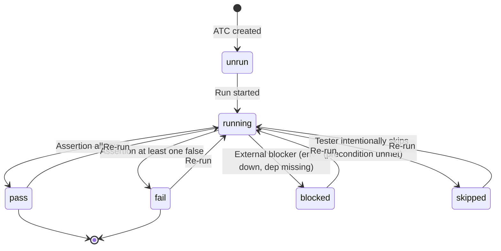
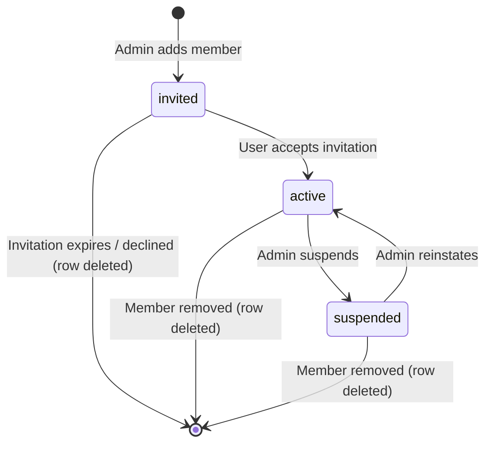

# Domain Glossary — Bunkai TMS

> Generated by `/project-discovery` Phase 1 (Constitution) on 2026-05-23. Single vocabulary of entities, columns, enums, and label-vs-identifier mappings consumed by every downstream skill (`/shift-left-testing`, `/sprint-testing`, `/test-documentation`, `/test-automation`, `/regression-testing`).
>
> Source of truth for DDL: `<target>/supabase/migrations/0001_tenancy.sql` … `0008_access_tokens.sql`. Re-run `/project-discovery` Phase 1.4 after schema changes.
>
> Reading order: this file → `business-data-map.md` (system flows) → `business-feature-map.md` (feature catalog, when generated post-discovery).

---

## Entities Cheat-Sheet

| Table | Purpose (one line) | Key FKs | CHECK enums | RLS? |
|---|---|---|---|---|
| `workspaces` | Tenant root; owned by one user; globally unique slug | `owner_user_id → auth.users` | `plan ∈ {community, cloud, enterprise}` | Yes |
| `workspace_members` | RBAC join — one row per (user, workspace) | `workspace_id`, `user_id → auth.users` | `role ∈ {viewer, member, admin, owner}` · `status ∈ {active, invited, suspended}` | Yes |
| `projects` | App under test, scoped to one workspace; slug unique per workspace | `workspace_id` | — | Yes |
| `modules` | Hierarchical test module tree (depth ≤ 6) with materialized path | `project_id`, `parent_module_id` (self-ref) | depth 1..6 (CHECK on `array_length(string_to_array(path,'/'),1)`) | Yes |
| `user_stories` | Business intent unit anchored to a module; Jira-linkable via `external_id` / `external_url` | `module_id` | — | Yes |
| `acceptance_criteria` | Ordered AC items per User Story; unique position per story | `user_story_id` | — | Yes |
| `atcs` | Acceptance Test Case (UI / API / Unit); full-text searchable via tsvector | `project_id`, `module_id`, `user_story_id` (RESTRICT) | `layer ∈ {UI, API, Unit}` · `status ∈ {pass, fail, blocked, skipped, running, unrun}` | Yes |
| `atc_steps` | Ordered steps inside an ATC; unique position per ATC | `atc_id` | — | Yes |
| `atc_assertions` | Ordered assertions inside an ATC; unique position per ATC | `atc_id` | — | Yes |
| `atc_acceptance_criteria` | M:N anchoring — ATC ↔ AC (the anchoring moat) | `atc_id`, `acceptance_criterion_id` | — | Yes |
| `access_tokens` | Personal Access Tokens for CLI / AI-agent bearer auth; soft-revocation | `user_id`, `workspace_id` (nullable for global tokens) | scopes non-empty subset of `{atc:read, atc:write, run:execute, workspace:admin}` | Yes |

**Total**: 11 tables across 8 migrations. RLS enabled on every table. 4 trigger functions + 4 RLS helpers + 2 RPCs (`bunkai_bootstrap_workspace`, `bunkai_save_atc`).

---

## Entities (detail)

### Workspace

Tenant container — the boundary every downstream row resolves to. Owned by exactly one user (`owner_user_id`). Slug is globally unique (one shared namespace across all tenants).

```sql
create table public.workspaces (
  id              uuid primary key default gen_random_uuid(),
  slug            text not null unique,
  name            text not null,
  owner_user_id   uuid not null references auth.users(id) on delete restrict,
  plan            text not null default 'community'
                    check (plan in ('community','cloud','enterprise')),
  created_at      timestamptz not null default now()
);
```

- **UI label**: "Workspace" (English) — no Spanish label confirmed in code yet.
- **Source**: `<target>/supabase/migrations/0001_tenancy.sql`.
- **Bootstrap**: workspaces cannot be created via a naked INSERT — the chicken-and-egg with `workspace_members` is solved by RPC `public.bunkai_bootstrap_workspace(p_slug, p_name)` (atomically inserts workspace + owner membership).

### Workspace Member

RBAC join. Composite primary key `(workspace_id, user_id)` enforces "one role per user per workspace".

```sql
create table public.workspace_members (
  workspace_id  uuid not null references public.workspaces(id) on delete cascade,
  user_id       uuid not null references auth.users(id) on delete cascade,
  role          text not null default 'member'
                  check (role in ('viewer','member','admin','owner')),
  status        text not null default 'active'
                  check (status in ('active','invited','suspended')),
  joined_at     timestamptz not null default now(),
  primary key (workspace_id, user_id)
);
```

- **Role hierarchy** (least → most privileged): `viewer` < `member` < `admin` < `owner`.
- **Status semantics**: `invited` = pending acceptance; `active` = authoritative for RLS check; `suspended` = data still exists but loses access.
- **UI labels**: not yet confirmed in repo — assume same English literals as DB until UI strings ship.
- **Source**: `<target>/supabase/migrations/0001_tenancy.sql`.

### Project

Represents the application-under-test inside a workspace. Slug unique per workspace (not globally — two workspaces can both have a project called `checkout`).

```sql
create table public.projects (
  id            uuid primary key default gen_random_uuid(),
  workspace_id  uuid not null references public.workspaces(id) on delete cascade,
  slug          text not null,
  name          text not null,
  description   text,
  created_at    timestamptz not null default now(),
  unique (workspace_id, slug)
);
```

- **UI route**: `/(app)/projects/[projectSlug]` (resolves to `id` via slug + active-workspace context).
- **Source**: `<target>/supabase/migrations/0002_projects_modules.sql`.

### Module

Hierarchical test-area tree per project. Self-referential (`parent_module_id`) + materialized path (`path`) for O(1) ancestor lookup. Depth capped at 6 via CHECK to keep tree-view recursive CTEs bounded.

```sql
create table public.modules (
  id                uuid primary key default gen_random_uuid(),
  project_id        uuid not null references public.projects(id) on delete cascade,
  parent_module_id  uuid references public.modules(id) on delete cascade,
  path              text not null,
  name              text not null,
  position          int not null default 0,
  created_at        timestamptz not null default now(),
  unique (project_id, path),
  constraint modules_path_depth_max_6
    check (array_length(string_to_array(path, '/'), 1) between 1 and 6)
);
```

- **Path format**: slash-separated slugs, e.g. `cart/add-to-cart/promo-codes` (depth = 3).
- **Position**: sort order among siblings within the same parent.
- **Source**: `<target>/supabase/migrations/0002_projects_modules.sql`.

### User Story

The unit of business intent. Anchored to a single module. JIRA linkage via free-text `external_id` + `external_url` (no FK to a Jira mirror — link is by string).

```sql
create table public.user_stories (
  id            uuid primary key default gen_random_uuid(),
  module_id     uuid not null references public.modules(id) on delete cascade,
  title         text not null,
  description   text,
  external_id   text,
  external_url  text,
  created_at    timestamptz not null default now()
);
```

- **UI label**: "User Story" (English). Likely Jira `Story` work type maps to `external_id = "BK-123"`.
- **Source**: `<target>/supabase/migrations/0003_authoring.sql`.

### Acceptance Criterion

Ordered AC items per User Story. `(user_story_id, position)` is unique → no duplicate positions per story (callers reorder by updating positions in a transaction).

```sql
create table public.acceptance_criteria (
  id              uuid primary key default gen_random_uuid(),
  user_story_id   uuid not null references public.user_stories(id) on delete cascade,
  title           text not null,
  description     text,
  position        int not null default 0,
  created_at      timestamptz not null default now(),
  unique (user_story_id, position)
);
```

- **UI label**: "Acceptance Criterion" / "AC" (English).
- **Source**: `<target>/supabase/migrations/0003_authoring.sql`.

### ATC (Acceptance Test Case)

The atomic, reusable test unit — Bunkai's signature concept. ATCs are mandatorily anchored to a User Story (`NOT NULL REFERENCES public.user_stories(id) ON DELETE RESTRICT`) and to ≥1 Acceptance Criterion via the M:N table `atc_acceptance_criteria` (application-enforced at create-time).

```sql
create table public.atcs (
  id              uuid primary key default gen_random_uuid(),
  project_id      uuid not null references public.projects(id) on delete cascade,
  module_id       uuid not null references public.modules(id) on delete cascade,
  user_story_id   uuid not null references public.user_stories(id) on delete restrict,
  slug            text not null,
  title           text not null,
  layer           text not null check (layer in ('UI','API','Unit')),
  version         int not null default 1,
  status          text not null default 'unrun'
                    check (status in ('pass','fail','blocked','skipped','running','unrun')),
  tags            text[] not null default '{}',
  tsv             tsvector,
  created_at      timestamptz not null default now(),
  updated_at      timestamptz not null default now(),
  unique (project_id, slug)
);
```

- **Layer semantics**: `UI` = browser-driven test; `API` = HTTP / contract test; `Unit` = code-level test (likely run by external CI, recorded in Bunkai post-hoc).
- **Status semantics**: see "State Machines" below.
- **Full-text search**: `tsv` is auto-refreshed by trigger `atcs_refresh_tsv` from `title + tags`; GIN-indexed for fast search.
- **Versioning**: `version` increments on every save via `bunkai_save_atc` RPC (`0007_save_atc.sql`). Edit propagation = "edit ATC-001 once, every test chaining it sees the new version".
- **UI label**: "ATC" (in code) — full name "Acceptance Test Case" in product docs; sometimes "Acceptance Test Case" in business-model.md (per UPEX Galaxy training context). The two names are used interchangeably in product copy.
- **Source**: `<target>/supabase/migrations/0004_atcs.sql`.

### ATC Step

Ordered, executable instructions inside an ATC. Position unique per ATC. Optional `input_data` and `expected` columns.

```sql
create table public.atc_steps (
  id          uuid primary key default gen_random_uuid(),
  atc_id      uuid not null references public.atcs(id) on delete cascade,
  position    int not null default 0,
  content     text not null,
  input_data  text,
  expected    text,
  unique (atc_id, position)
);
```

- **Authoring**: bulk-saved via `bunkai_save_atc` RPC (deletes existing + re-inserts from `p_steps jsonb`).
- **Source**: `<target>/supabase/migrations/0004_atcs.sql`.

### ATC Assertion

Ordered post-conditions / expectations inside an ATC. Lighter-weight than steps (no input_data / expected — just `content`).

```sql
create table public.atc_assertions (
  id        uuid primary key default gen_random_uuid(),
  atc_id    uuid not null references public.atcs(id) on delete cascade,
  position  int not null default 0,
  content   text not null,
  unique (atc_id, position)
);
```

- **Source**: `<target>/supabase/migrations/0004_atcs.sql`.

### ATC ↔ Acceptance Criterion (M:N)

The **anchoring moat**. Every ATC must reference ≥1 AC (enforced application-side at create-time; DB has no NOT NULL on the join because composite PK already prevents nulls).

```sql
create table public.atc_acceptance_criteria (
  atc_id                    uuid not null references public.atcs(id) on delete cascade,
  acceptance_criterion_id   uuid not null references public.acceptance_criteria(id) on delete cascade,
  primary key (atc_id, acceptance_criterion_id)
);
```

- **Cardinality**: one ATC satisfies ≥1 AC; one AC is covered by ≥0 ATCs (an unattached AC is a coverage gap).
- **Source**: `<target>/supabase/migrations/0004_atcs.sql`.

### Access Token (PAT)

Personal Access Tokens for CLI + AI-agent bearer auth. Issued via `POST /api/v1/tokens` (session-authenticated). The server returns the raw secret exactly once in the format `bk_pat_<prefix>.<secret>`. Storage uses SHA-256 of the secret + the first 12 chars as a lookup-only prefix.

```sql
create table public.access_tokens (
  id uuid primary key default gen_random_uuid(),
  user_id uuid not null references auth.users (id) on delete cascade,
  workspace_id uuid references public.workspaces (id) on delete cascade,
  name text,
  token_prefix text not null,
  hash text not null,
  scopes text[] not null,
  expires_at timestamptz,
  revoked_at timestamptz,
  last_used_at timestamptz,
  created_at timestamptz not null default now(),
  constraint access_tokens_scopes_nonempty check (array_length(scopes, 1) >= 1),
  constraint access_tokens_scopes_allowed check (
    scopes <@ array['atc:read', 'atc:write', 'run:execute', 'workspace:admin']::text[]
  )
);
```

- **Token format**: `bk_pat_<12-char-prefix>.<secret>`. Middleware looks up by prefix (O(1)), then constant-time-compares the SHA-256 hash.
- **Scope semantics**:
  - `atc:read` — list/get ATCs, steps, assertions.
  - `atc:write` — create/update ATCs, steps, assertions.
  - `run:execute` — record run outcomes (`pass/fail/blocked/...`); the agentic/CI execution surface.
  - `workspace:admin` — admin ops (members, plan, settings).
- **`workspace_id` semantics**: `NULL` = global / cross-workspace token (admin or AI-agent use cases that need to enumerate workspaces); non-NULL = scoped to one workspace.
- **Revocation**: soft — `revoked_at` set; row not deleted.
- **Source**: `<target>/supabase/migrations/0008_access_tokens.sql`.

---

## Enumerations

All CHECK-constraint enums in one place — single source for downstream test fixtures and ATC parameterization.

| Enum | Values (ordered if ordinal) | Used in | Source |
|---|---|---|---|
| `workspace.plan` | `community`, `cloud`, `enterprise` | `workspaces.plan` | `0001_tenancy.sql` |
| `workspace_member.role` | `viewer` < `member` < `admin` < `owner` (privilege order) | `workspace_members.role` | `0001_tenancy.sql` |
| `workspace_member.status` | `active`, `invited`, `suspended` | `workspace_members.status` | `0001_tenancy.sql` |
| `atc.layer` | `UI`, `API`, `Unit` (no implied order) | `atcs.layer` | `0004_atcs.sql` |
| `atc.status` | `pass`, `fail`, `blocked`, `skipped`, `running`, `unrun` | `atcs.status` | `0004_atcs.sql` |
| `access_token.scope` (array, subset of) | `atc:read`, `atc:write`, `run:execute`, `workspace:admin` | `access_tokens.scopes` | `0008_access_tokens.sql` |

---

## State Machines

### `atcs.status` — ATC lifecycle

Inferred from enum values + product usage (run lifecycle); transitions not explicitly enforced by triggers — application code is responsible.



`unrun` = baseline at ATC creation. `running` is transient (set when execution starts, cleared on outcome). Terminal-ish states (`pass`, `fail`) are not actually terminal in the DB — any state can transition back to `running` on re-run.

### `workspace_members.status` — Membership lifecycle



Status `invited` is pre-accept; RLS treats only `active` rows as authoritative. `suspended` keeps the row visible to admins but blocks data access.

---

## UI label ↔ code identifier mapping

| UI surface | Code identifier (table / column) | Notes |
|---|---|---|
| "Workspace" | `workspaces` | English only as of 2026-05-23 |
| "Project" | `projects` | — |
| "Module" | `modules` | tree node; path is slash-separated |
| "User Story" | `user_stories` | Jira-link via `external_id` (e.g., `BK-123`) |
| "Acceptance Criterion" / "AC" | `acceptance_criteria` | Ordered by `position` |
| "ATC" / "Acceptance Test Case" / "Acceptance Test Case" | `atcs` | Three names used in product copy; treat as synonyms |
| "Step" | `atc_steps` | — |
| "Assertion" | `atc_assertions` | — |
| "Personal Access Token" / "PAT" / "API Token" | `access_tokens` | `bk_pat_<prefix>.<secret>` format |
| "Role" | `workspace_members.role` | viewer / member / admin / owner |
| "Status" (on ATC) | `atcs.status` | pass / fail / blocked / skipped / running / unrun |
| "Layer" | `atcs.layer` | UI / API / Unit |
| "Scope" (on token) | `access_tokens.scopes` (array) | atc:read / atc:write / run:execute / workspace:admin |

---

## Discovery Gaps

- [ ] **Bug entity** — referenced in `business-model.md` but not in any migration 0001-0008. Confirm if it ships in a later migration or is MVP-deferred.
- [ ] **Test entity** — `business-model.md` says "tests are ordered chains of ATCs". No `tests` table in migrations 0001-0008 either — Test may be a virtual concept (a saved query / collection over ATCs) or scheduled for a future migration.
- [ ] **Run entity** — `atcs.status` and "run" terminology imply a `runs` history table (e.g., `atc_runs`); not in migrations 0001-0008. Confirm or schedule.
- [ ] **Workspace `slug` collision policy** — globally unique; what happens when an enterprise customer wants `acme` and someone else already took it? UI conflict handling not yet visible.
- [ ] **Jira sync** — `user_stories.external_id` / `external_url` exist but no sync table / job detected. Confirm whether Jira sync is bidirectional or read-only inbound.
- [ ] **Spanish UI labels** — codebase appears English-only; confirm if internationalization is planned and what the label table would look like.
- [ ] **PAT delete policy** — `access_tokens` has no `for delete` RLS policy. Confirm intent (soft-revoke via `revoked_at` only?) — important so framework tests don't expect hard delete to work.
